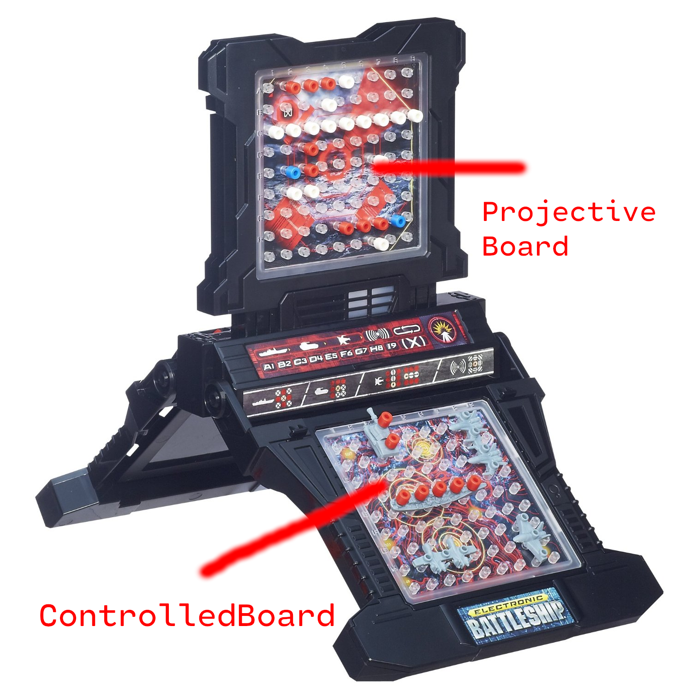

## Turns

### AI Turn

1. Compute move based on `hits` and `misses`
1. Apply move to player's board

### Player's Turn

1. Select 

## Two types of board

### Projective boards

Shows hits & misses

### Controlled boards

Shows ships & sunken ships
